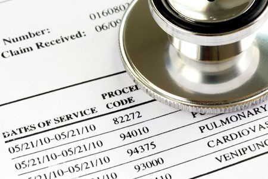

## Healthcare Fraud Detection

The U.S. Department of health and human services in a pamphlet Avoiding Medicare Fraud and Abuse: A Roadmap for Physicians states “most physicians strive to work ethically, render high-quality medical care to their patients, and submit proper claims for payment,” yet “the presence of some dishonest health care providers who exploit the health care system for illegal personal gain has created the need for laws that combat fraud and abuse and ensure appropriate quality medical care.”

Medical fraud happens when a physician knowingly submitting false claims or making misrepresentations.  For example, a fraudster physician may collude with a pharmacist to add more expensive medicines to the prescription claim without the awareness of the patient. Then this false drug prescription claim is submitted to the insurer for reimbursements.This project aims to identify healthcare providers who are likely to be involved in fraud. 

**Steps**

- Exploratory data analysis (EDA) for the healthcare industry
- Create insightful features for machine learning and anomaly detection.
- Dimension reduction: PCA (principal component analysis)
- Clustering: Kmeans, identify outlier

**Features**

Feature 1. total number of discharge by provider 

Feature 2. ratio of total number of discharge by provider to the median level of discharges in the same city 

Feature 3. ratio of average coverage by a provider / median coverage for this clinical condition in the state 

Feature 4. ratio of average total payment to a provider / median for this clinical condition in the state 

Feature 5. ratio of average total medicard coverage paid to a provider / median medicare coverage for this clinical condition in the state 

Note: From EDA, we found the data are left skewed, thus median is more preferred than mean as a meansurement to state level. 

