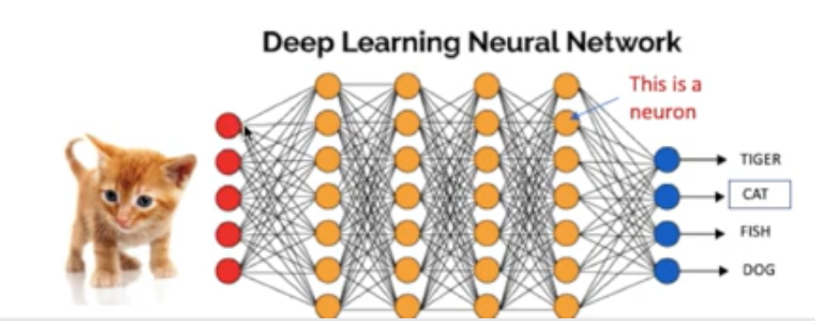

# Neural network - autoencoder

**Autoencoder**

Autoencoder is a special type of neural network that uses the same data as both the input values and output values. The goal is to get the middle layer which reduces noises, it can also be considered as a method of dimension reduction. 

Autoencoder uses non-linear transformation, if there are too many hidden layers or too many neutrons, the model tends to overfit; otherwise the model tends to underfit.

Applications of autoencoder include image noise reduction and image coloring. 

