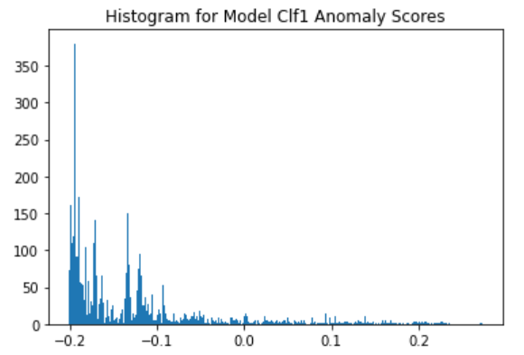

# Neural network - autoencoder

**Autoencoder**

Autoencoder is a special type of neural network that uses the same data as both the input values and output values. The goal is to get the middle layer which reduces noises, it can also be considered as a method of dimension reduction. 

Autoencoder uses non-linear transformation, if there are too many hidden layers or too many neutrons, the model tends to overfit; otherwise the model tends to underfit.

Applications of autoencoder include image noise reduction and image coloring. 

**Business insights** 
From the graph, we can see most observations are on the left of 0. The observations above 0.2 are extreme cases, we will set the boundary to be 0.2 Observations on the right of 0.2 are in cluster 1, they accounts for 1.1% of total transactions. They have more spending on cardholder level, however, it takes more time for this transaction to happen. It is possible that the card is stolen or lost, then being used again. 

# Neural network - Isolated Forest

